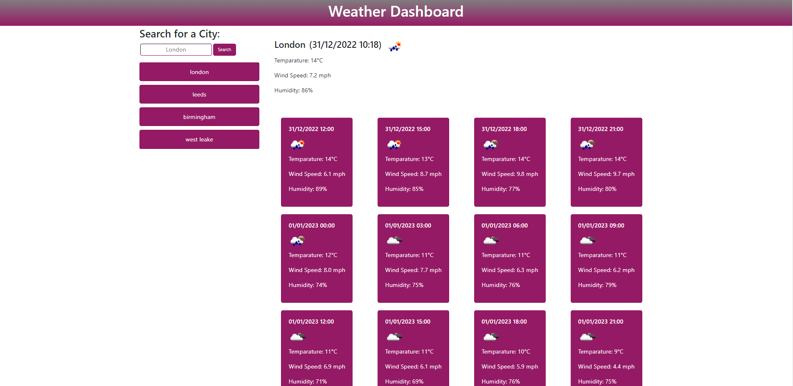

# Weather Dashboard

## Description

### The Task

I was tasked with building a weather dashboard that runs in the browser and features dynamically updated HTML and CSS. I was required to use the [5 Day Weather Forecast](https://openweathermap.org/forecast5) to retrieve weather data for cities and use local storage to store any persistent data. 

The dashboard should display the current weather forecast and a 5 day forecast.

## The requirements

* Create a weather dashboard with form inputs.
  * When a user searches for a city they are presented with current and future conditions for that city and that city is added to the search history
  * When a user views the current weather conditions for that city they are presented with:
    * The city name
    * The date
    * An icon representation of weather conditions
    * The temperature
    * The humidity
    * The wind speed
  * When a user view future weather conditions for that city they are presented with a 5-day forecast that displays:
    * The date
    * An icon representation of weather conditions
    * The temperature
    * The humidity
  * When a user click on a city in the search history they are again presented with current and future conditions for that city

## Usage

To access the website, navigate to [Weather Dashboard](https://darrenoxley7.github.io/weather-dashboard). Use the search box towards the top left of the screen to search for a city then click search. Below is an example of the final search result.

## Known bugs

If a city name appears in multiple countries there is no way to select a specific country. As an example, searching for "Birmingham" will default to Birmingham (US) and users cannot define the search parameters to target a UK search. This will be rectified in a future release.

## Installation

To view the code navigate to the website using the link above and right click on any website element and cick inspect or download the source code from [My GitHub repo](https://github.com/DarrenOxley7/weather-dashboard.git) and open the index.html, style.css and script.js file in VS Code.

## Credits

### Resources:

MIT License

Copyright (c) 2022 DarrenOxley7

Permission is hereby granted, free of charge, to any person obtaining a copy
of this software and associated documentation files (the "Software"), to deal
in the Software without restriction, including without limitation the rights
to use, copy, modify, merge, publish, distribute, sublicense, and/or sell
copies of the Software, and to permit persons to whom the Software is
furnished to do so, subject to the following conditions:

The above copyright notice and this permission notice shall be included in all
copies or substantial portions of the Software.

THE SOFTWARE IS PROVIDED "AS IS", WITHOUT WARRANTY OF ANY KIND, EXPRESS OR
IMPLIED, INCLUDING BUT NOT LIMITED TO THE WARRANTIES OF MERCHANTABILITY,
FITNESS FOR A PARTICULAR PURPOSE AND NONINFRINGEMENT. IN NO EVENT SHALL THE
AUTHORS OR COPYRIGHT HOLDERS BE LIABLE FOR ANY CLAIM, DAMAGES OR OTHER
LIABILITY, WHETHER IN AN ACTION OF CONTRACT, TORT OR OTHERWISE, ARISING FROM,
OUT OF OR IN CONNECTION WITH THE SOFTWARE OR THE USE OR OTHER DEALINGS IN THE
SOFTWARE.